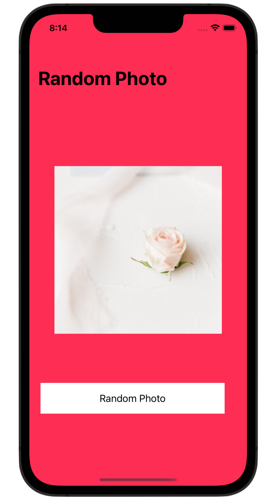

# Random Photo

---

Generate a random photo by clicking a button.

As part of the [tutorial](https://youtu.be/yuo50-TiKgo).

The image is provided by [this API](https://source.unsplash.com/random/600x600).

# Stack

- [Swift](https://www.swift.org)
- [UiKit](https://developer.apple.com/documentation/uikit)

# [LICENSE](./LICENSE)

Public domain.
